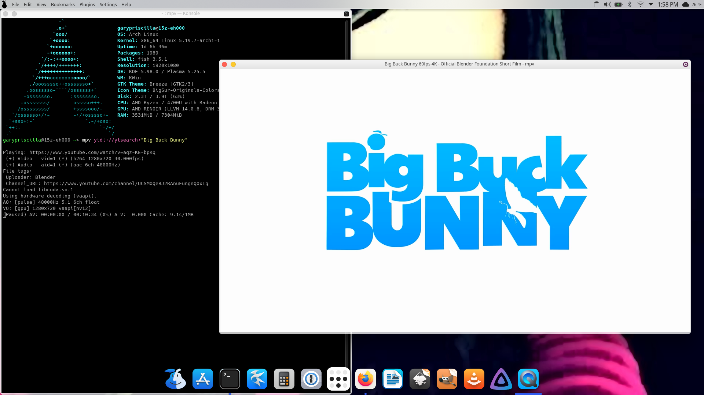

`mpv` is a full function media player that I love to use. One way that I use mpv is by playing videos or music from YouTube with the youtube-dl plugin. Actually, I use a fork of youtube-dl called yt-dl, but nevertheless I digress. To play a video from Youtube using mpv just simply add the videos url.
```
mpv https://www.youtube.com/watch?v=YE7VzlLtp-4
```
To play just audio, you can add the --no-video flag.
```
mpv --no-video https://www.youtube.com/watch?v=YE7VzlLtp-4
```
Another cool function that mpv has is the ytsearch function. This allows you to search for a video or song and play the results.
```
mpv ytdl://ytsearch:"Big Buck Bunny"
```

Using this feature, I made for myself a 5 line Bash script that will play 10 random songs from Youtube based on a search that I can use in the terminal while I'm working. Here's the script.
```
#!/bin/bash

SEARCH=$*
echo "Playing Music based on the search: "$SEARCH
mpv --shuffle --no-video ytdl://ytsearch10:"$SEARCH" --ytdl-format=bestaudio
```
I put this script into my /usr/bin/ directory and called it "playtube". Alternatively, you could create a function in your bashrc file with the contents of this script. Now when I want to listen to some Limp Bizkit, I can simply type:
```
playtube 'Limp Bizkit'
```
And mpv provides me with 10 random songs from Youtube and all the world is right for a few minutes!
