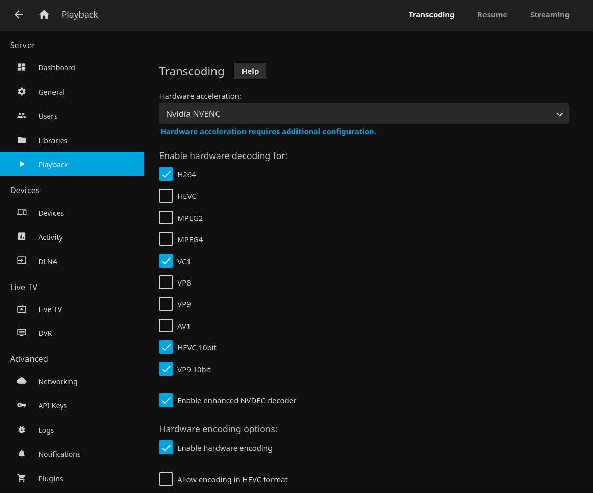

In short, yes... well maybe?

Now that I've spoiled the ending, let me tell you how I came to find this out. Obviously I have a Geforce GT 710, and I have something that I need to encode. It was only a matter of time before I would find out if hardware encoding is possible using Nvidia's NVENC.

The card I'm using is the MSI variant that I bought sometime around 2016 solely for its hdmi output and because it was the cheapest new card on Newegg at the time. This card is still being sold new as an economy video card. I'm not sure how good it would work for gaming. I suspect not too well, but I can recall playing Gran Turismo 2 on PCSX using this card at one point of its history.

Recently, I began looking at hardware encoding for Jellyfin. And while scouring the internet looking for other people's solutions, I became quickly under the impression that NVENC is not supported on the GT 710. Even NVIDIA's support [matrix](https://developer.nvidia.com/video-encode-and-decode-gpu-support-matrix-new) doesn't list the GT 710 nor does it list any Kepler based cards. The 1st gen Maxwell architecture is the oldest gpu listed. However, a few things didn't quite add up.

For example, NVIDIA's [SDK Docs](https://docs.nvidia.com/video-technologies/video-codec-sdk/nvenc-application-note/) say that the first architecture to support NVENC was Kepler. And, Kepler can encode H.264 streams, which most if not all of my library consists of.  The next key to the puzzle was that apparently the GT 710 [could be either a Fermi device or a Kepler device.](https://forums.developer.nvidia.com/t/geforce-gt-710/199172)  And according to [Robert Crovella](https://forums.developer.nvidia.com/u/Robert_Crovella) (NVIDIA forum moderator), some Kepler devices can run CUDA 11. #foreshadowing

After installing the card into my Arch Linux server, I checked the Arch wiki to see which driver I should use. According to the [wiki](https://wiki.archlinux.org/title/NVIDIA#Installation), I need to use the nvidia-470xx-dkms driver from the AUR.
```
yay -Sy nvidia-470xx-dkms
```
After a reboot, I checked to see if the driver was loaded.
```
lspci -k | grep -A 2 -E "(VGA|3D)"
01:00.0 VGA compatible controller: NVIDIA Corporation GK208B [GeForce GT 710] (rev a1)
        Subsystem: Micro-Star International Co., Ltd. [MSI] Device 8c93
        Kernel driver in use: nvidia
```
It did in fact load!

Looking at nvidia-smi, I saw that the card was running CUDA 11.4. So this MSI card must be at least a Kepler card.  To see if it could encode using NVENC, I did a test using ffmpeg.
```
ffmpeg -i big_buck_bunny.mp4 -c:v h264_nvenc -rc constqp -qp 28 -c:a copy big_buck_bunny.mkv
```
Success! It's not the fastest card out there. It ran at 70 fps, but I was finally able to encode a video without maxing out all 8 threads of my CPU! Now that I know that ffmpeg can use NVENC to encode, I turned my attention to Jellyfin.

Jellyfin, like PLEX, uses ffmpeg to transcode video. However, my Jellyfin instance is running in a container which separates it (somewhat) from the server's hardware. To mitigate this, we must pass the hardware to the container. We can do this by installing and using NVIDIA's container toolkit.
```
yay -S nvidia-container-toolkit
```
Afterwards, we need to instruct Jellyfin to look for this hardware. Taken from Jellyfin's [documentation](https://jellyfin.org/docs/general/administration/hardware-acceleration.html), I added this to my docker-compose yaml file.
```
services:
  jellyfin:
    image: jellyfin/jellyfin
    # ... my Jellyfin config
    deploy:
      resources:
        reservations:
          devices:
            - capabilities: [gpu]
```
I then recreated the image.
```
docker-compose pull
docker-compose up -d
```
Finally, we go to our Jellyfin dashboard and enable transcoding using NVIDIA NVENC and test.

Although the GT 710 isn't the fastest card out there, it can still give my server a little more headroom while streaming movies from Jellyfin. Before this install, transcoding movies would max the server CPU (Intel Core i7 - 870) load. Now, it slightly raises the CPU load. That's a huge win.
