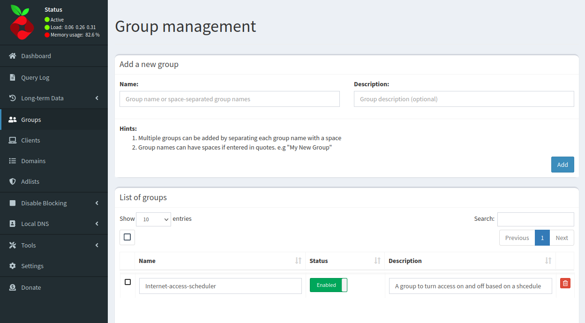
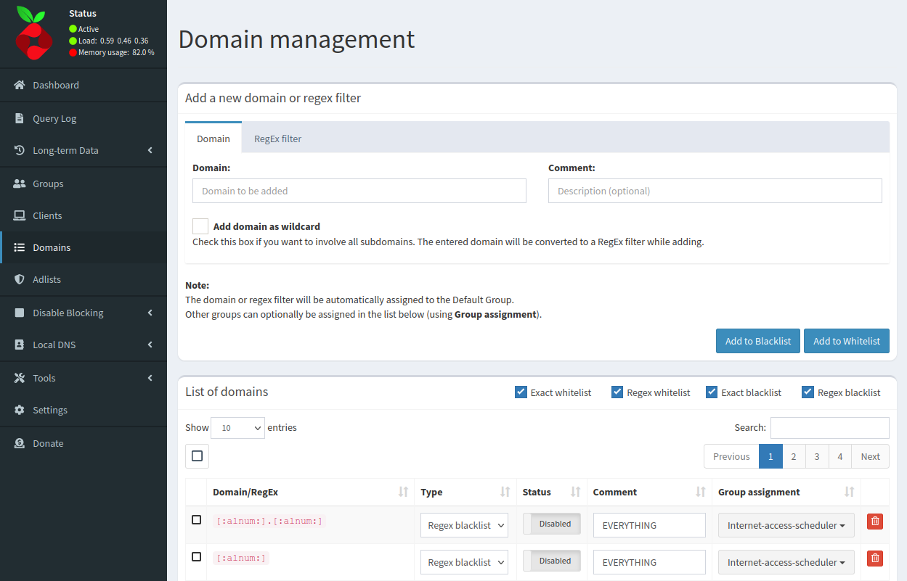
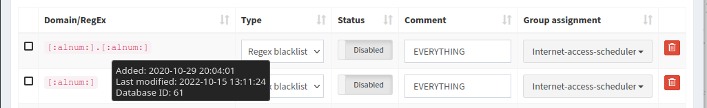

Pi-hole is a great ad blocking dns filter, but I wanted to take it one step further and use it to completely block internet access to certain devices during a set period of time. This wasn't too difficult to do using Systemd timers and a little sqlite3 magic.
## Pi-hole settings
With Pi-hole you can set groups of clients to only be affected by certain domain filters, and so, we're going to use this feature. First, I create a group called internet-access-scheduler, and then add all of the devices on my LAN that I want included in this group. For my use, this will include my kids' school and personal laptops and computers, phones, tablets, and TVs.

Next, I need to create a domain filter. This filter, however, will be ALL domains. I can simply use the Pi-hole regex [:alnum:].[:alnum:]. Then I add the internet-access-scheduler group to the domain filter.

## Systemd Timer
Now that we have the filter and group created, it's time to turn our attention to the Systemd timer.  I first create a service called internet-access-schedule-off.service.
```
sudo nano /etc/systemd/system/internet-access-schedule-off.service
```
In this file, we add the following lines.
```
[Unit]
Description=Turn Internet Access off

[Service]
Type=oneshot
ExecStart=sqlite3 /etc/pihole/gravity.db "Update domainlist SET enabled = 1 WHERE type IN (3) and id in (61, 62);"
ExecStart=pihole restartdns reload-lists
```
In this service, an entry in the Pi-hole gravity database found at /etc/pihole/gravity.db, namely, the domainlist database will be changed. I'm changing the ___enable___ field to 1 in ___type 3___, this points to Pi-hole's regex blacklist, and ___id___ 61 and 62. This is the id number to our domains we want to enable. You can find the id by simply hovering your mouse over the regex entry.

Afterwards, the service instructs Pi-hole to restart the dns and reload the lists. I do the same thing in creating the internet-access-schedule-on.service with the only difference being that I set enabled as 0 and change the description.
```
[Unit]
Description=Turn Internet Access on

[Service]
Type=oneshot
ExecStart=sqlite3 /etc/pihole/gravity.db "Update domainlist SET enabled = 0 WHERE type IN (3) and id in (61, 62);"
ExecStart=pihole restartdns reload-lists
```
Now I need to make the timer to go with the service.
```
sudo nano /etc/systemd/system/internet-access-schedule-off.timer
```
And in this file I write the following.
```
[Unit]
Description=Turn access to dns off

[Timer]
OnCalendar=Sun 19:00:00
OnCalendar=Mon 19:00:00
OnCalendar=Tue..Thu 19:00:00
OnCalendar=Fri 19:00:00
OnCalendar=Sat 19:00:00
Persistent=true

[Install]
```
This timer tells Systemd to run the service at certain times on certain days. For example, on Sunday at 1900hrs (7:00 pm) run the service.
The timer for the  internet-access-schedule-on.service looks like this.
```
[Unit]
Description=Turn access to dns on at 7:00 am

[Timer]
OnCalendar=7:00:00
Persistent=true

[Install]
WantedBy=timers.target
```
This is telling Systemd to run this service every day at 7:00 am. Why didn't I just create the internet-access-schedule-off.timer with the same simple ___OnCalendar___ entry? I want to make it easier for me to change one day or a weekend without affecting the other days.

The last step is to start the timers.
```
sudo systemctl enable --now internet-access-schedule-off.timer
sudo systemctl enable --now internet-access-schedule-on.timer
```
And that's it! Now I'm going to sit back and relax knowing that at 7:00 pm my kids will be so impressed at my networking skills!

This has proven to be a really nice addition to my Pi-hole installation. If you would like to get a copy of the timer and service files, you can find them on my [Github](https://github.com/GSSparks/Pi-hole-Filter-Scheduler) page.
